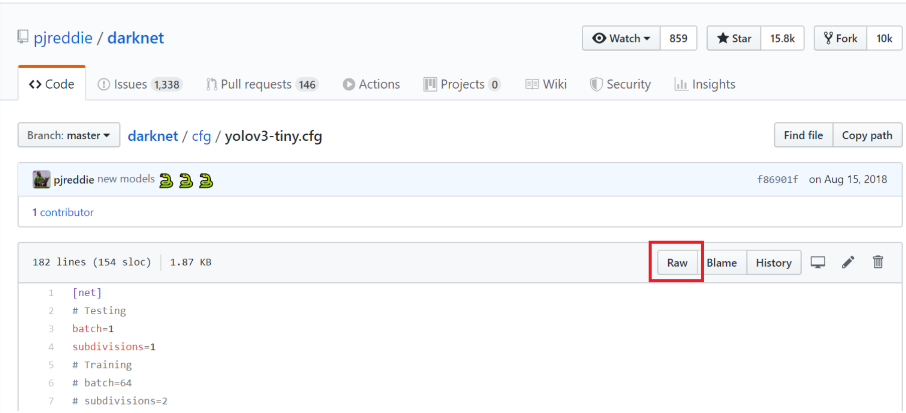
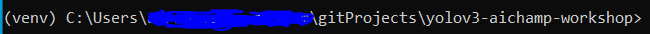

# yolov3-aichamp-workshop

This guide assumes that you are using windows OS.
---

#### Step 0:
Before you start any of the following steps, it's smart to start downloading files to instantiate the YOLO network.

**Note:** We have provided a utility function which download and places files where you want them. ```Introduction.ipynb``` has a step which will download the files we need. However, as the weights file is quite big, it can be smart to start it now.

For ```introduction.ipynb```, we need the following files:

[YOLOv3 configuration file](https://raw.githubusercontent.com/pjreddie/darknet/master/cfg/yolov3.cfg)

[YOLOv3 weight file](https://pjreddie.com/media/files/yolov3.weights)

[COCO labels file](https://raw.githubusercontent.com/pjreddie/darknet/master/data/coco.names)

We have added a couple more configuration and their associated weights in the table below (with some extra stats for the nerds among us ;)): 

config|weight|FLOPs|FPS|mAP
---|---|---|---|---
|[config](https://raw.githubusercontent.com/pjreddie/darknet/master/cfg/yolov3-spp.cfg)|[weight](https://pjreddie.com/media/files/yolov3-spp.weights)|141.45 Bn|20|60.6
|[config](https://raw.githubusercontent.com/pjreddie/darknet/master/cfg/yolov3-tiny.cfg)|[weight](https://pjreddie.com/media/files/yolov3-tiny.weights)|5.56 Bn|220|33.1

**Note** If you decide to download your own config, make sure you download the raw version of the file as shown in the image below:



More options can be found [here](https://pjreddie.com/darknet/yolo/). Keep in mind that this implementation might not support everything there.

Note that YOLO-320, YOLO-416 and YOLO-608 actually use the same configuration and weights. The difference is in the way we tell YOLO to scale the input. We will get back to this later in the workshop. It is infact the configuration and weight you were told to download at the start, so no need to download them again!

#### Step 1:
Download and install python 3.X (This workshop was made using [3.7.5](https://www.python.org/ftp/python/3.7.5/python-3.7.5-amd64.exe). As of making this workshop, there is a bug with ```3.8```, so don't use it).

Verify install with ```py -V``` using CMD.

#### Step 2:

Download this repo to your computer:
```git clone https://github.com/Adsime/yolov3-aichamp-workshop.git```.

```cd``` into the project.

#### Step 3:

It's recommended that you create a virtual environment. If you don't want to, skip to **step 4**.

Create a virtual environment:

```py -m venv ./venv```

Activate it:

```.\venv\Scripts\activate.bat```

If your terminal looks something like this, then the virtual environment is activated:



#### Step 4:

Install dependacies:

```pip install -r requirements.txt```

#### Step 5:

Start jupyter notebook:

```jupyter notebook```

There are 3 notebooks made for this workshop. 

* **introduction.ipynb** will give an overview of all the code in the project.
* **image_workshop.ipynb** will do the same as introduction, but let you edit the parameters more easily yourself to play around with.
* **video_workshop.ipynb** uses the youtube_dl library, which lets us download youtube videos and perform live object detection on them.